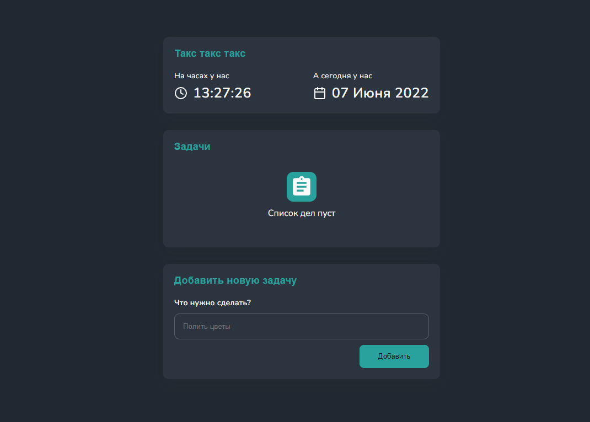
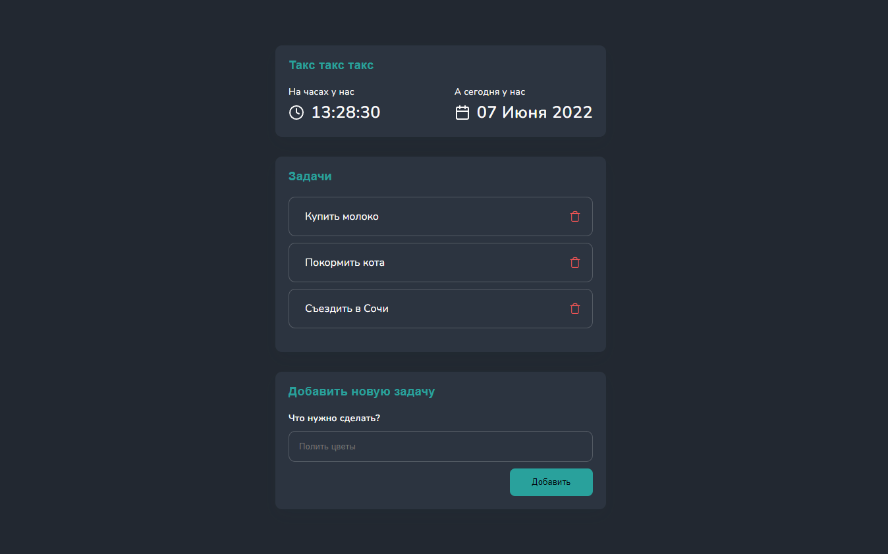
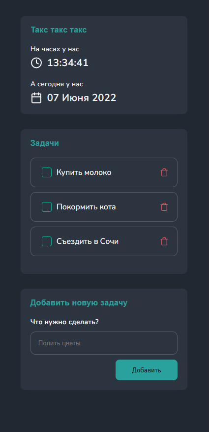

<h1 align="center">ToDo</h1>

<h2 align="center"><a  href="https://bund322.github.io/todo-list/" target = "_blank">Посмотреть ДЕМО</a></h2>

## Описание

ToDo list реализованный на HTML, CSS (SCSS) и чистом JavaScript.

## О проекте

- Стиль страницы сверстан с помощью SCSS, CSS flexbox.

- Хранение задач реализованно с помощью веб-хранилища local storage.
- Использован шрифт Krona One с Google Fonts.
- Сайт адаптирован для мобильных устройств.

### Спасибо за внимание

